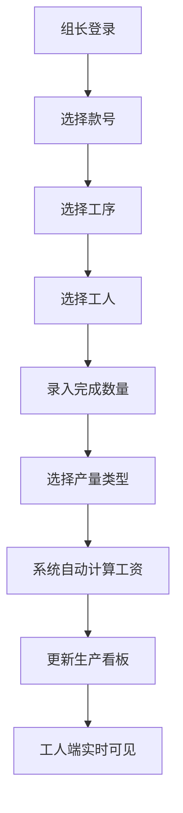
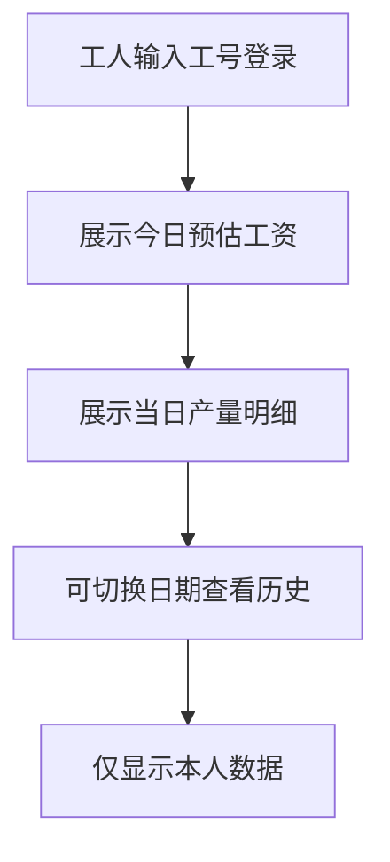
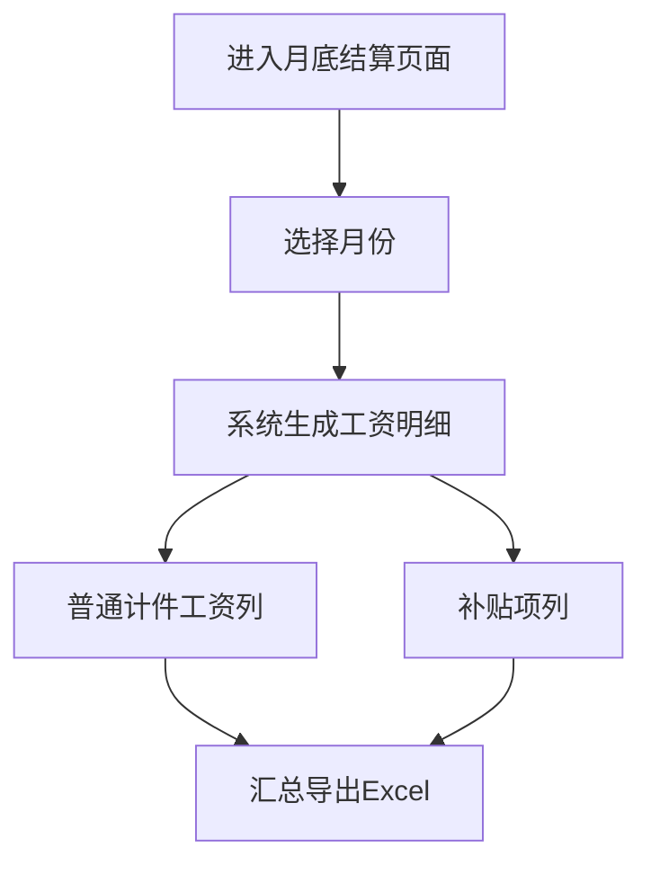

## 1. 产品概述

服装厂计件工资管理看板系统，面向服装生产车间的计件工资核算与透明化管理。通过组长端录入生产数据，工人端实时查看个人收入，实现产量透明化、工资预估即时化、月底结算高效化。

- 核心用户：车间组长（数据录入管理）、一线工人（个人收入查看）
- 核心价值：替代纸质计件记录，减少核算错误，提升工资透明度，激励生产效率

## 2. 核心功能

### 2.1 用户角色

| 角色 | 登录方式 | 核心权限 |
|------|----------|----------|
| 组长 | 账号密码登录 | 款号/工序/工价管理、产量录入、数据统计、月底导出 |
| 工人 | 工号+姓名登录 | 查看个人今日工资预估、历史记录、个人产量明细 |

### 2.2 功能模块

1. **组长端 - 生产看板**：今日产量总览、各款号进度、工人产量排行
2. **组长端 - 款号工序管理**：款号增删改、工序设置、工价配置
3. **组长端 - 产量录入**：按工人录入完成数、区分返工/缺料/质检不过
4. **组长端 - 月底导出**：按月导出工资明细，普通计件与补贴分列
5. **工人端 - 个人中心**：今日工资预估、当日产量明细、历史记录查询

### 2.3 页面详情

| 页面名称 | 模块名称 | 功能描述 |
|----------|----------|----------|
| 登录页 | 角色选择登录 | 组长/工人角色切换，工号/账号登录验证 |
| 组长-首页看板 | 数据概览 | 今日总产量、总工资、款号进度卡片、产量趋势图 |
| 组长-款号管理 | 款号列表 | 款号CRUD、工序配置、工价设置、补贴项管理 |
| 组长-产量录入 | 录入表单 | 选择款号工序、选择工人、录入数量、选择产量类型（正常/返工/缺料/质检不过） |
| 组长-统计报表 | 数据统计 | 按日/周/月统计、按工人/款号/工序多维度分析 |
| 组长-月底结算 | 导出功能 | 按月生成工资表、普通计件与补贴分列、Excel导出下载 |
| 工人-个人首页 | 工资预估 | 今日预估工资卡片、累计收入、产量明细列表 |
| 工人-历史记录 | 历史查询 | 按日期查看历史产量和工资 |

## 3. 核心流程

### 3.1 组长录入产量流程

组长登录后，选择款号和工序，选择工人，录入完成数量，选择产量类型（正常/返工/缺料/质检不过），系统自动计算工资金额并更新看板数据。

### 3.2 工人查看工资流程

工人通过工号登录手机端，首页展示今日预估工资和产量明细，可查看历史记录。工人只能看到自己的数据，无法查看他人收入。

### 3.3 月底导出流程

## 4. 用户界面设计

### 4.1 设计风格

- **主色调**：深蓝色（#1e3a8a）作为主色，代表专业、可靠；橙色（#f97316）作为强调色，代表活力、高效
- **辅助色**：绿色（#10b981）表示正常产量，红色（#ef4444）表示异常（返工/质检不过），黄色（#f59e0b）表示缺料
- **字体**：标题使用思源黑体（Source Han Sans），正文使用系统无衬线字体，数字使用等宽字体增强可读性
- **按钮风格**：圆角矩形，轻微阴影，hover时有微放大和颜色加深效果
- **布局风格**：卡片式布局，信息分组清晰，数据看板采用网格化布局
- **图标风格**：线性图标，简洁现代，与文字配合使用

### 4.2 页面设计概览

| 页面名称 | 模块名称 | UI 元素 |
|----------|----------|---------|
| 登录页 | 登录表单 | 居中卡片式设计、角色切换Tab、输入框带图标、渐变背景 |
| 组长-首页看板 | 数据概览 | 顶部统计卡片组、中部款号进度列表、底部产量趋势图、侧边导航 |
| 组长-款号管理 | 列表管理 | 顶部搜索+新增按钮、表格列表、行内编辑、工序配置弹窗 |
| 组长-产量录入 | 录入表单 | 分步表单设计、工人选择器、数字输入键盘、产量类型标签选择 |
| 组长-月底结算 | 导出页面 | 月份选择器、数据预览表格、普通计件/补贴分列、导出按钮 |
| 工人-个人首页 | 工资卡片 | 大字号今日工资、累计收入进度条、产量明细列表、下拉刷新 |

### 4.3 响应式设计

- **桌面优先**：组长端主要在电脑端使用，采用侧边导航+内容区的经典布局
- **移动端适配**：工人端主要在手机端使用，采用底部Tab导航，优化触控交互
- **触控优化**：按钮最小高度44px，列表项足够间距，支持滑动操作
- **响应式断点**：sm(640px)、md(768px)、lg(1024px)、xl(1280px)

### 4.4 交互细节

- 数据看板数字滚动动画，提升视觉冲击力
- 产量录入成功后有确认反馈和轻量音效
- 工资预估卡片有呼吸光效，突出重点数据
- 列表项左滑/右滑快捷操作（删除、修改）
- 页面切换时的淡入淡出过渡动画
