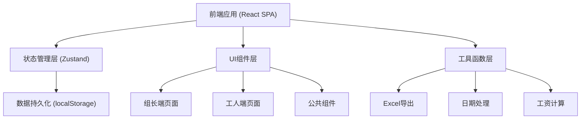

## 1. 架构设计

本系统为纯前端单页应用（SPA），采用 React + Vite 技术栈，数据存储使用 localStorage + 内存状态管理，支持导出 Excel 文件。不依赖后端服务，数据持久化在浏览器本地。



## 2. 技术描述

- **前端框架**：React@18 + TypeScript
- **构建工具**：Vite@5
- **样式方案**：TailwindCSS@3
- **状态管理**：Zustand
- **路由管理**：React Router DOM@6
- **图表库**：Recharts（产量趋势图）
- **Excel导出**：xlsx (SheetJS)
- **图标库**：lucide-react
- **数据存储**：localStorage（前端本地存储，模拟后端数据）
- **UI 组件**：基于 TailwindCSS 自定义组件，不引入重量级 UI 库

## 3. 路由定义

| 路由路径 | 页面/组件 | 权限 | 说明 |
|----------|-----------|------|------|
| `/login` | LoginPage | 公开 | 登录页，支持组长/工人角色切换 |
| `/leader/dashboard` | LeaderDashboard | 组长 | 组长首页-生产看板 |
| `/leader/styles` | StyleManagement | 组长 | 款号工序管理 |
| `/leader/entry` | ProductionEntry | 组长 | 产量录入 |
| `/leader/reports` | ReportsPage | 组长 | 统计报表 |
| `/leader/export` | ExportPage | 组长 | 月底结算导出 |
| `/worker/home` | WorkerHome | 工人 | 工人首页-今日工资预估 |
| `/worker/history` | WorkerHistory | 工人 | 历史记录查询 |
| `/worker/profile` | WorkerProfile | 工人 | 个人信息 |

## 4. 数据模型

### 4.1 实体关系图

```mermaid
erDiagram
    STYLE ||--o{ PROCESS : contains
    PROCESS ||--o{ PRODUCTION_RECORD : has
    WORKER ||--o{ PRODUCTION_RECORD : produces
    SUBSIDY ||--o{ PRODUCTION_RECORD : "applies to"

    STYLE {
        string id PK
        string styleNo
        string styleName
        string description
        date createdAt
    }

    PROCESS {
        string id PK
        string styleId FK
        string processName
        number unitPrice
        number sortOrder
    }

    WORKER {
        string id PK
        string workerNo
        string name
        string role
        string password
        date createdAt
    }

    PRODUCTION_RECORD {
        string id PK
        string workerId FK
        string processId FK
        string styleId FK
        number quantity
        string productionType
        number unitPrice
        number amount
        date date
        string remark
        date createdAt
    }

    SUBSIDY {
        string id PK
        string name
        string type
        number amount
        string workerId FK
        date date
        string remark
    }
```

### 4.2 数据类型定义

```typescript
// 产量类型
type ProductionType = 'normal' | 'rework' | 'material_shortage' | 'quality_fail';

// 款号
interface Style {
  id: string;
  styleNo: string;
  styleName: string;
  description?: string;
  createdAt: string;
}

// 工序
interface Process {
  id: string;
  styleId: string;
  processName: string;
  unitPrice: number;
  sortOrder: number;
}

// 工人
interface Worker {
  id: string;
  workerNo: string;
  name: string;
  role: 'leader' | 'worker';
  password: string;
  createdAt: string;
}

// 生产记录
interface ProductionRecord {
  id: string;
  workerId: string;
  processId: string;
  styleId: string;
  quantity: number;
  productionType: ProductionType;
  unitPrice: number;
  amount: number;
  date: string;
  remark?: string;
  createdAt: string;
}

// 补贴项
interface Subsidy {
  id: string;
  name: string;
  type: 'bonus' | 'allowance' | 'other';
  amount: number;
  workerId?: string;
  date: string;
  remark?: string;
}

// 工资汇总
interface SalarySummary {
  workerId: string;
  workerName: string;
  workerNo: string;
  baseSalary: number;      // 普通计件工资
  subsidyTotal: number;    // 补贴合计
  totalSalary: number;     // 总工资
  records: ProductionRecord[];
  subsidies: Subsidy[];
}
```

### 4.3 初始模拟数据

- 预设 2 个组长账号（admin/123456）
- 预设 10 个工人账号（工号 001-010，密码 123456）
- 预设 3 个款号，每款 5-8 道工序
- 预设最近 30 天的生产记录用于演示

## 5. 核心模块划分

### 5.1 目录结构

```
src/
├── assets/              # 静态资源
├── components/          # 公共组件
│   ├── layout/         # 布局组件
│   ├── ui/             # UI 基础组件
│   └── charts/         # 图表组件
├── pages/              # 页面组件
│   ├── login/          # 登录页
│   ├── leader/         # 组长端页面
│   └── worker/         # 工人端页面
├── store/              # 状态管理
│   ├── useAuthStore.ts
│   ├── useStyleStore.ts
│   ├── useProductionStore.ts
│   └── useWorkerStore.ts
├── types/              # TypeScript 类型定义
├── utils/              # 工具函数
│   ├── date.ts
│   ├── salary.ts
│   ├── export.ts
│   └── storage.ts
├── hooks/              # 自定义 Hooks
├── constants/          # 常量定义
├── App.tsx
├── main.tsx
└── index.css
```

### 5.2 核心业务逻辑

1. **工资计算**：数量 × 工价 = 金额，返工/缺料/质检不过按设定比例（默认分别为 0%、50%、0%）计算
2. **产量类型区分**：
   - 正常（normal）：100% 计件工资
   - 返工（rework）：0% 计件工资（不计入工资，仅记录数量）
   - 缺料（material_shortage）：50% 计件工资（可配置）
   - 质检不过（quality_fail）：0% 计件工资（不计入工资）
3. **月底导出**：按工人汇总，分列普通计件工资和各项补贴，导出 Excel
4. **权限控制**：基于角色的路由守卫，工人只能访问自己的数据

## 6. 状态管理设计

使用 Zustand 进行状态管理，按业务领域拆分 store：

- `useAuthStore`：登录状态、当前用户信息
- `useStyleStore`：款号和工序数据
- `useWorkerStore`：工人列表管理
- `useProductionStore`：生产记录、工资计算
- 所有 store 持久化到 localStorage

## 7. 导出功能设计

使用 xlsx 库生成 Excel 文件，包含以下 Sheet：
- **工资汇总表**：工号、姓名、普通计件工资、各补贴项、总工资
- **计件明细表**：按工人列出所有计件记录
- **补贴明细表**：按工人列出所有补贴记录

导出格式：.xlsx，文件名格式：`工资表_YYYY年MM月.xlsx`
